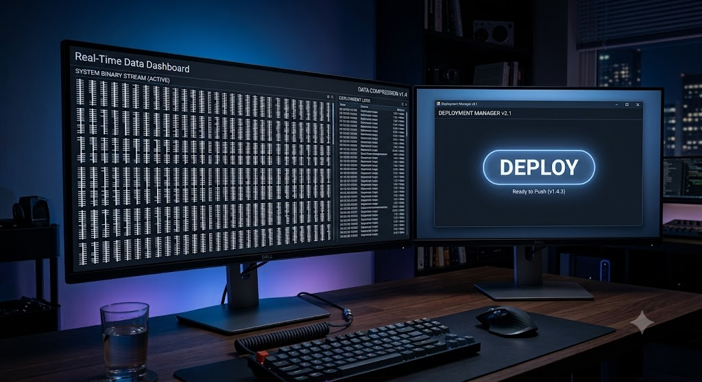
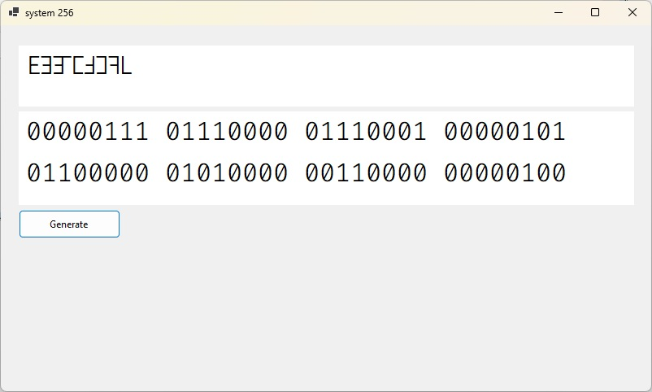
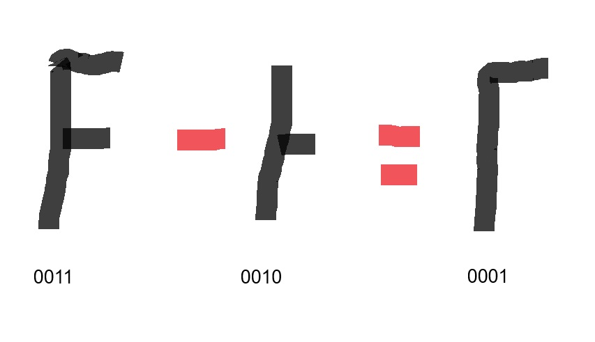
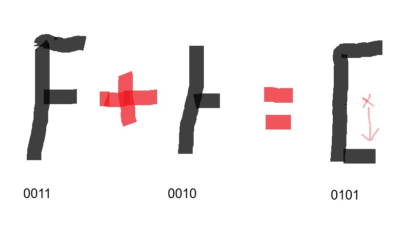
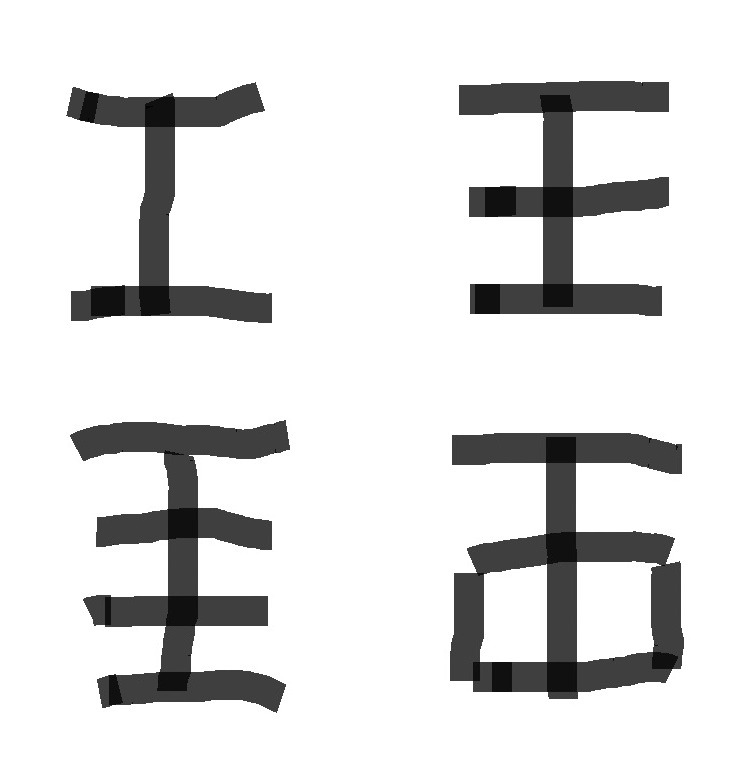
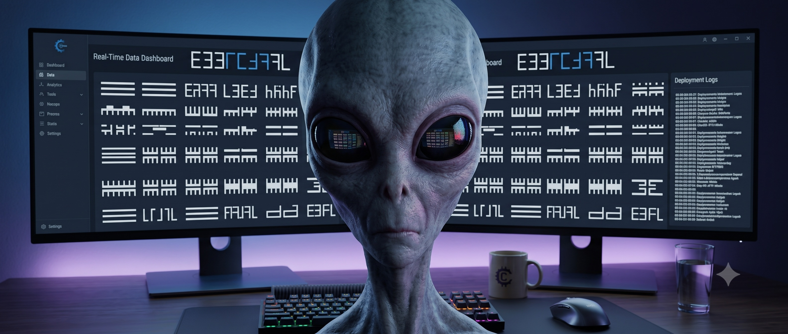

# Base256-Visual-Encoding
An experimental Base-256 visual encoding system that represents a full byte using a single layered glyph


# BitMatrix-Encoding: A Flexible, Zero-Mental-Calculation Visual Encoding System

An experimental, scalable visual encoding font-system designed to bridge the gap between human-readable aesthetics and raw binary data representation.

## 💡 The Problem with Hexadecimal & High Bases
Standard numerical systems like Hexadecimal (`Base-16`) or `Base-64` achieve high data density on the screen but fail drastically at human mental decoding. When a developer sees `3B`, they cannot instantly "see" the underlying binary structure (`00111011`) without executing arithmetic operations or mental mapping.

## 🚀 The Solution: Direct Visual Mapping (No Mental Math)
**BitMatrix-Encoding** introduces a geometric, comb-like dynamic structure where characters don't just *represent* a value—they **physically draw it**. 

Each glyph is split into a **4-bit block (Nibble)** represented by structural "teeth" or bars. Each prong corresponds directly to an active bit (`1`). By looking at the shape, the human eye instantly decodes the exact binary pattern without calculation.

### Key Features:
- **Dynamic Scale Configuration:** The system can scale dynamically based on application needs. It supports **Base-8, Base-10, Base-16, Base-64, Base-128, and Base-256**.
- **Compound Layered Glyphs:** To represent a full byte (`Base-256`), the engine layers two 4-bit compound glyphs seamlessly inside a single text cell using `Zero-Width` font metrics.
- **Optimized UI Performance:** Reduces text rendering pipelines (Draw Calls) on high-density dashboards by condensing massive binary streams into ultra-compact, easily scannable visual patterns.

---

## 🖼️ Proof of Concept (How It Looks)

As shown in our .NET UI implementation below:
- The custom comb-like glyph (e.g., the `E`-like shape) represents specific active binary states (e.g., `0111`).
- You can dynamically optimize the font array (e.g., using a 4-prong glyph for standard 16-value variations or bridging bottom prongs to denote higher state bits).

🎯 Intended Applications
High-Performance Binary Log Viewers.

Real-time Network Packet Analyzers (Wireshark-like text outputs).

Low-level Hex Editors with enhanced scannability.

Compact Financial and Data Visualization Dashboards.

📄 License
This project is licensed under the MIT License - open for community contributions and further glyph-set scaling!



## 🛠️ Implementation & Architecture

The project consists of two core layers:
1. **The Vector Font Pack (`.ttf`):** Designed using FontForge, leveraging the *Private Use Area (PUA)* starting from `U+E000` to prevent any OS control character collision.
2. **The Translation Engine (.NET):** A lightweight rendering logic that processes raw byte arrays, executes low-level bit shifting, and renders compound glyphs seamlessly.

### Example C# Code Snippet:
```csharp
// Load the private binary font from the application folder
PrivateFontCollection pfc = new PrivateFontCollection();
pfc.AddFontFile("FiraCode-BitMatrix.ttf");

// Set TextBox font
txtDisplay.Font = new Font(pfc.Families[0], 24, FontStyle.Regular);

// Render lower and upper nibbles in a single visual cell
txtDisplay.Text = "\uE003" + "\uE012";
```


## 🧮 Native Visual Arithmetic (Zero-ALU Mental Mapping)

One of the most powerful features of **BitMatrix-Encoding** is that arithmetic operations (Addition & Subtraction) can be solved **completely visually** by merging or subtracting the horizontal prongs, mirroring how logical gates operate at the hardware level.

### 1. Visual Subtraction (The Annihilation Principle)
In subtraction, when two glyphs are layered or compared, overlapping prongs in the same horizontal position **annihilate (cancel) each other out**. 
* **Rule:** If a prong on the first glyph meets a prong on the second glyph at the exact same level $\rightarrow$ both prongs disappear.
* **Result:** The remaining, unmatched prongs form the final visual result instantly. 

*(This perfectly visualizes the standard bitwise XOR/AND-NOT behaviors without manual binary conversion).*

### 2. Visual Addition (The Cascading Flow Principle)
In addition, when combining two glyphs, prongs from both characters merge into a single matrix. If two prongs occupy the same horizontal level, they invoke a "cascade" or "carry" effect:
* **Rule 1:** If a prong moves to a slot that is **empty**, it settles there.
* **Rule 2:** If a prong meets another prong at the same level, it **cascades (shifts) down to the next available horizontal slot**. If that slot is also full, it continues shifting down until it finds the first empty slot to settle in.

*(This acts as a beautiful, real-time spatial simulation of the Binary Carry Flag and Bit-Shifting operations).*

### Visual Subtraction Example (As shown in the diagram below)

Imagine subtracting the value `2` (`0010`) from `3` (`0011`):
1. **First Glyph (`0011`):** Features two horizontal prongs (Top & Middle).
2. **Second Glyph (`0010`):** Features one horizontal prong (Middle only).
3. **The Operation:** The overlapping Middle prong is visually canceled out.
4. **The Result (`0001`):** Only the Top prong remains, physically forming the glyph for `1`.



### Visual Addition Example (As shown in the diagram below)

Imagine adding the value `2` (`0010`) to `3` (`0011`):
1. **First Glyph (`0011`):** Features two horizontal prongs (Top & Middle).
2. **Second Glyph (`0010`):** Features one horizontal prong (Middle only).
3. **The Operation:** The Top prong stays in place. However, the two Middle prongs collide. 
4. **The Cascade:** Since the middle slot is full, the colliding prong cascades down (as shown by the pink arrow), bypassing any filled states until it finds the next available empty slot at the bottom.
5. **The Result (`0101`):** The prongs are now positioned at the Top and Bottom slots, physically forming the unified glyph for `5` without any electronic ALU instruction.



## 📐 Scalability & Human Visual Optimization (Base-16 to Base-256)

The system is highly versatile and adapts its geometric complexity based on the required data density (Radix/Base). To make high-density data easily readable without causing human eye strain, the layout evolves from simple grids to enclosed shapes:

### 1. Base-16 (Hexadecimal Variant)
* **Structure:** A simple vertical spine with a maximum of 4 horizontal prongs (split or layered).
* **Example (Top-Left):** Represents a 4-bit nibble value. The human eye can instantly spot the binary state `1111` without parsing raw numerals.

### 2. Base-64 Variant
* **Structure:** Extends up to 6 prongs (Top-Right) to map 6 active bits dynamically. 
* **Capacity:** Capable of representing 64 unique values natively in a single block.

### 3. Base-256 (Full Byte Variant) & Human-Centric Design
When representing a full 8-bit byte (`11111111`), rendering 8 open horizontal bars sequentially can clutter the visual field. To optimize human scannability, the system offers two architectural choices:
* **The Standard 4-Prong Stack (Bottom-Left):** A balanced approach for uniform bit rows.
* **The Enclosed Loop Architecture (Bottom-Right):** To denote higher-order active bits or a fully saturated byte, the bottom prongs are **closed/looped together**. This block enclosure creates a distinct geometric shape that the human brain instantly registers as a fully filled lower nibble status, providing supreme visual comfort and lightning-fast scannability on dense logging dashboards.



## 🛠️ Current Preview Font & Call for Contributions

To demonstrate the core architecture, the provided preview font (`FiraCode-Light.ttf`) currently contains **8 initial reference glyphs** mapped to the Private Use Area (PUA) of Unicode. 

You can render and test the existing experimental glyphs in your .NET environment using their exact hex addresses:

```vbnet
' Render the 8 initial preview glyphs sequentially
TextBox1.Text = ChrW(&HE001) & ChrW(&HE002) & ChrW(&HE003) & ChrW(&HE004) &
                ChrW(&HE005) & ChrW(&HE006) & ChrW(&HE007) & ChrW(&HE008)
```
Join the Project (Call for Contributors!)
The system logic is fully defined, but the visual matrix is wide open for evolution. We are calling the global open-source community to help expand this project:

Type Designers / Font Creators: Help build the full 16-nibble matrix variations (and their zero-width counterparts) using FontForge or Glyphs.

Systems Engineers: Implement encoding/decoding wrappers in languages like Rust, C++, or Go to convert raw byte arrays directly into this visual matrix.

Feel free to fork the repository, open an Issue, or submit a Pull Request with your glyph designs and optimizations!


## 🌌 Conclusion: Non-Conventional Design for Post-Human Systems

The goal of BitMatrix-Encoding was to create a data representation system that is geometrically scalable and directly visually interpretable. 

In some ways, we are not just designing a new font; we are defining the aesthetic logic of machine-human interfaces. This system represents a visual language of computation that could potentially serve low-level system views, massive high-density data dashboards, or even, metaphorically speaking, the kind of data a non-human entity might analyze with zero arithmetic interpretation required. The final rendered image below encapsulates this "Post-Human" design philosophy:




